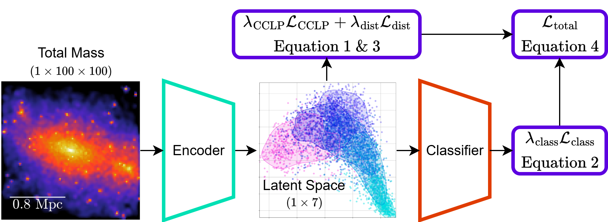

# Interpretable Deep Compact Clustering for Measuring Dark Matter Self-Interaction Cross-Section

This repository implements a clustering neural network for constraining the dark matter self-interaction cross-section
from galaxy clusters using cosmological simulations.  
The method builds an interpretable latent space where galaxy clusters are grouped by physical similarity, enabling
robust parameter estimation in sparsely sampled parameter spaces while providing confidence measurements to detect
out-of-domain data and exploration of secondary features in the data.  
We apply this method to the BAHAMAS-SIDM and DARKSKIES simulations and demonstrate accurate recovery of the
self-interaction cross-section when the test data lies within the training domain and reliable rejection of foreign
datasets, offering a blueprint for robust machine learning for scientific inference.

The research paper can be found on [Astronomy & Astrophysics](TEMP) or the [arXiv](TEMP).

The code is based on the [PyTorch-Network-Loader](https://github.com/EthanTreg/PyTorch-Network-Loader) (heron referred
to as netloader) framework, which provides a flexible and modular way to build neural networks for scientific
applications.  
The code is structured to allow easy modification and extension for different datasets and architectures.  
Please refer to the [documentation](https://github.com/EthanTreg/PyTorch-Network-Loader/wiki) in the repository for more
details on how to use the framework.

# How to Use
1. Clone the repository.
2. Install the requirements: `pip install -r requirements.txt`
3. Obtain data for training, the BAHAMAS-SIDM and DARKSKIES simulations can be obtained from the original authors:
   [BAHAMAS-SIDM](https://doi.org/10.1093/mnras/stz1815) and [DARKSKIES](TEMP), or use your own data.
   This method was designed around predicting macroscopic parameters obtained from several image samples.
4. Create a PyTorch dataset based on the netloader `BaseDataset` class.
   1. If using the BAHAMAS-SIDM or DARKSKIES simulations, you can use the class `DarkDataset` from `src.utils.data`
      after pre-processing the data using `src.preprocessing` and adding the key 'name' with the value of the dataset
      name (this is just for plotting) to the generated pickled dictionary.
   2. If using your own data, you can follow the class `DarkDataset` from `src.utils.data` and the
      [documentation](https://github.com/EthanTreg/PyTorch-Network-Loader/wiki/4.-Custom-Datasets) as templates and
      modifying them for your own data formatting.
5. Configure the `config.yaml` file to your needs, including:
   1. Dataset path (`global-variables`&rarr;`data-variables`&rarr;`data-dir`)
   2. Model architecture (`main`&rarr;`training`&rarr;`network-name`)
   3. Training parameters (`main`&rarr;`training`)
   4. Output directories (`global-variables`&rarr;`output-variables`)
   5. Save and load names (`main`&rarr;`training`&rarr;`network-save` and `network-load`)
6. Run the training script: `python -m src.main`.
7. After training, several plots will be generated in the plots directory, including loss curves, latent space PCA, and
   full latent space visualisations.
8. The trained network can then be loaded and used for inference or further training by loading the saved file by first
   making sure that both `src` and `netloader` have been initialised (through an import) and either using
   `torch.load('path/to/saved/network.pth')` or `load_net(save_num, states_dir, network_name)` from
   `netloader.networks`. If there is a pickling error due to weights only load failed, then if this is due to a class
   from this repository or netloader, make sure to import `src` and `netloader`, if it is due to `slice`, then you can
   add `slice` to the safe globals using `torch.serialization.add_safe_globals([slice])` before loading the network.
9. To generate predictions or to further train, first create the dataset using the class from step 4, then create the
   data loaders using `loader_init(dataset, batch_size=batch_size, ratios=(1,),
   idxs=dataset.idxs[np.isin(dataset.extra['ids'], net.idxs)])` from `netloader.data`, where `dataset.extra['ids']` are
   unique ids for each sample in all the datasets and `net.idxs` are the ids used during training, this will return the
   train and validation data loaders.
   1. For further training, you can use `net.training((train_loader, val_loader), epochs=epochs)`.
   2. For predictions, you can use `net.predict(val_loader)` to get the predictions for the validation set.

# System Specifications

The system specifications used to develop the network are:
- Operating system: Ubuntu 24.04
- CPU: AMD Ryzen 7 7700 8C/16T
- GPU: NVIDIA RTX 4080 16 GB VRAM

NVIDIA GPUs with more than 4 GB of VRAM are recommended for training the full network, the batch size can be reduced to
reduce VRAM usage, the reduced network can be trained on GPUs with more than 500 MB of VRAM.
If a GPU with the minimum VRAM requirements in not available, you can train on the CPU, but this will be significantly
slower.
SSDs are strongly recommended for storing the data as this will significantly reduce data loading times.

# Training Times

Training the full network for 150 epochs with 10,000 samples takes around 19.7 minutes on the GPU and 7.3 hours on the
CPU.  
Training the reduced network for 150 epochs with 10,000 samples takes around 6.4 minutes on the GPU and 20.3 minutes on
the CPU.
